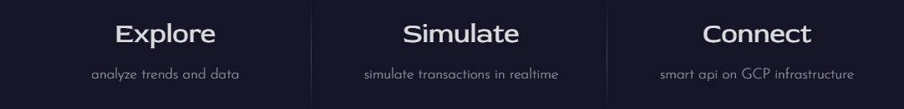

## Mira X Documentation – realTime Edge in PYUSD Transactions

Mira X is an innovative, multidimensional analytics tool designed to deliver real-time insights for both users and developers. Its mission is to accelerate PYUSD stablecoin adoption by making its usage simpler, smarter, cheaper, and impactful across the DeFi and crypto ecosystem.

let's take a look at *ALL* of its features grounded in its interactive UI Hub:
### Features of MiraX
MiraX is built around three core features:

**Explore** — track and visualize PYUSD ***adoption trends*** in real-time.

**Simulate** — ***optimize your PYUSD transactions*** in a risk-free sandbox.

**Connect** — plug into MiraX’s self-hosted *Data Provider* to build smart, data-driven apps.

#### Explore: 
the Explore feature delivers actionable insights into PYUSD adoption and performance within the DeFi ecosystem. key highlights include:
-   **Adoption Metrics**: tracks PYUSD usage trends and growth.
-   **Transaction Analysis**: breaks down gas costs for swaps and transfers, highlighting PYUSD’s contribution to Ethereum network congestion via hourly average gas consumption.
-   **Liquidity & Staking Pools**: analyzes PYUSD’s role in top pools on Curve Finance, comparing volume, swap rates, gas costs, and more.

The *Intelligent Data Explorer* combines historical & real-time **pyusd** data powered by a GCP Blockchain RPC Websocket. it works seamlessly with MiraX's BigQuery database and Cloud Run containers which schedule periodic syncs of this data to the cloud, while ensuring the frontend maintains its subscription to Firestore for continuous data updates.

#### Sandbox:
the *Sandbox* feature lets you simulate and analyze PYUSD transactions by interacting with ***smart contracts***, *transaction hashes*, and ***historical logs stored in BigQuery***. *3 major features* of Mira X sandbox includes:

**Exploring Trace Level** details of PYUSD transactions on Ethereum Mainnet and Sepolia. Powered by GCP Blockchain RPC, this feature ***replays transactions*** on an interactive, flow-like canvas, mapping out how each node (call) connects. Users can uncover:
- the role of each node (*was it a transfer?, balance check or contract withdrawal?*) .
- which contract consumed the most gas.
- how many calls were made.
- decoding the input data for deeper insights.

The highlight of the Sandbox (Add Tx) feature is transforming ***complex transaction data*** into a vibrant, color-coded canvas. With a single click, *each node reveals its purpose*, offering a clear, bird’s-eye view of how your transaction unfolded.

> analogy: you know how you never spend two minutes looking at a blockchain tx on etherscan, mirax sandbox tool is gonna **make u spend** *2 hours* just exploring a *PYUSD* transaction.

**Gas-Optimized Transactions** feature helps users save on costs and make smarter trades. Powered by the MiraX Data Provider (behind the Explore feature) and integrated with Reown (formerly WalletConnect), it leverages GCP Blockchain RPC to deliver:

* *Gas Fee Estimation*: analyzes contract details to estimate gas prices and costs.
* *Balance Checks*: ensures sufficient funds for transfers.
	
 * *SimulationBox Insights*: computes metrics to optimize trades answering questions such as : **is now the best time to trade?**, **are gas costs reasonable for your transaction?**, ***should you wait for lower fees based on trends?***

the _Sandbox Mock Tx_ feature allows you to simulate transfers and swaps across MiraX supported pools, mirroring real transactions on Curve Finance. Get real-time insights on ***slippage, gas costs, and pool fees***—without risking your funds.

> analogy: while testing out the **Wallets** feature, I was stunned to see high-activity wallets racking up over $50 in daily fees. what ratio could those fees be cut down with by just utilizing the mirax sandbox tool?

the **Wallets** feature in the Sandbox lets users monitor and measure their PYUSD transaction activity. Beyond personal tracking, it offers a ***Wallet Mocking*** option to analyze any address’s 7-day activity report, including *transactions*, ***gas consumed***, and ***staking details***.

the mocking feature can be initiated from the ***Transaction Trace Canvas*** or directly in the Wallets UI. For example, after examining a transaction hash, you can mock its address to dive deeper. While mocking, your connected wallet becomes secondary for as long as mocking lasts.

> analogy: the wallets UI is so sleek, fast and precise that it could double as a detective tool for tracking PYUSD activity, but to be clear, its highly accurate reports are built purely for educational purposes, and not for snooping purposes...

**Mirax Connect API**

> details on the Connect feature, also known as the MiraX Connect API

after seeing the performance of MiraX's Data Provider, I was inspired to extend it. The WebSocket streams thousands of ***pyusd*** transactions daily, keeping everything up to date. Building the components to pull this data into the web app was extensive, so to make it more efficient, I decided to host similar components in a GCP container.

I created a **WebSocket server** that *clients can connect to* using a ***required token***, allowing real-time, filtered, and analyzed PYUSD data to be passed to them for live insights
 
> **Purpose of the Connect Feature:**   the process starts with getting data, preprocessing, storing, analyzing, hosting, and finally distributing it. This can be time-consuming, but the **MiraX Connect API** simplifies it by letting you focus only on connecting to real-time data.

The API is designed for developers building smart payment solutions and DeFi PYUSD apps. To demonstrate the process, I’ve launched a mini Telegram app to illustrate how the connection works in practice.

***Access Webapp here: **https://mira-x.netlify.app/*****

### Tech Stack Used for Mira X
- Next.js & Typescript
- D3.js & GSAP (interactive charts n animations)
- Xyflow (sandbox canvas)
- GCP (BigQuery, Firestore, Blockchain RPC, Cloud Run)
- third party APIs n Services (coingecko, curve finance, fly.io)
- wallet connection (wagmi, ethers, reown)

### Detailed Integration steps
**STEP 1: Setting Up Data Backfill W/ BigQuery**
- the first step was building the data backend. The bounty provided access to the **GCP-maintained Ethereum Crypto dataset on BigQuery**, which I used to perform a thorough *historical backfill* of PYUSD-related data
- while blockchain RPCs *can* be used to fetch past data, they’re better optimized for **real-time subscriptions** than large-scale backfills, making BigQuery the ideal solution for this step.
- by querying the `bigquery-public-data.goog_blockchain_ethereum_mainnet_us` dataset, i was able to backfill ***PYUSD*** transaction history into two distinct tables - ***transfer_logs*** & ***lp_activity_and_gas***. take a look at the method used in [*this script*](app/componets/explore/backFillData/BigQueryBackfill.py) and [*this too*](app/componets/explore/backFillData/BigQueryBackfillGas.py)

- the *transfer_logs table* contains all standard PYUSD transaction data, ***excluding internal contract calls*** that could skew the results. to ensure only valid `Transfer` events were captured, I filtered transactions *using a safe topic offset*: **`0xddf252ad1be2c89b69c2b068fc378daa952ba7f163c4a11628f55a4df523b3ef`** which corresponds to the Transfer event_signature. 
- this method is a reliable way to extract actual transaction data, ***why?*** - because almost every on-chain event whether it's a **token swap**, **bridge transfer**, or **direct transfer**—**emits a `Transfer` event** as part of the process.
- ***lp_activity_and_gas***  table is deeper but shorter as it tracks **liquidity pool activity** and **gas usage**, to keep it relevant, i limited the historical backfill for this to just **the past 3 months**.

- it was necessary to make a ***join across three distinct tables*** [*logs, receipt and transaction*] in the GCP Maintained dataset to capture *gas usage*, *full transaction metadata*, and Curve Liquidity Pool *Swap events*. 
- each tx contained the following fields such as: ***block_timestamp***, ***tx_hash***, ***address***, ***event_signature***, ***event_type***, ***topics***, ***args***, ***from_address***, ***to_address***, ***input***, ***gas_price***, ***gas_used***, ***status*** etc.
- the main goal of ***lp_activity_and_gas table*** was to correctly tag Swap & Transfer Only Events (***in a custom event_type field***). this was crucial to how the data will be visualised and utilised in sandbox. 

> problem - all swaps transactions include the `Transfer` topic even if the event originated from a liquidity pool contract & transfer events with transfer topics could actually be part of a larger swap / multi-contract interaction.

**solution:** aside tracking just logs, make a join with transactions table and *match "transfer" transactions with the input data*: **0xa9059cbb**. To correctly tag Swaps, match transactions from the LP contract address that emitted ***the Pool Swap-specific events***, confirm their data structure matches a valid swap payload **(>=258)** which are later decoded into: *buyer, token_bought, token_sold* etc.

**STEP 2: Realtime Subscription W/ Firestore**
- to complete the **data pipeline**, we've to **replicate the same structure and logic** used in the BigQuery tables inside the **`pyusd_websocket`** data streams.

- the first step is to **connect** to the GCP Blockchain RPC WebSocket using the **`eth_subscribe`** method. this means it subscribes to new block headers and listens for the specific **topics** and **events** defined in the params
- the ***transfer_logs table*** is reproduced by subscribing to **eth_getLogs** events, using the PYUSD contract address: **`0x6c3ea9036406852006290770bedfcaba0e23a0e8`** and `Transfer ` topics. For each log, make subsequent calls to *eth_getTransactionByHash*, *eth_getTransactionReceipt*. 
- the ***lp_activity_and_gas table*** is reproduced in a similar way, by subscribing to the Curve Pools contract address, relevant topics, and decoding the data fields into their respective args, *directly in the Websocket server*.
- for Transfers, we use the initial subscription but **filter** for input fields that match **direct PYUSD transfers**.
- with proper ***retry logic and quadratic backoff***, we ensure that the data fields are accurately populated, in the rare case that a fetch fails, the field is passed as null (*if non critical*), for fields like block_timestamp, ***a fallback value is assigned*** (using Date.now) or *that transaction is dropped* (exam, missing essential data in args field that could break the querying logic down the line).
- with the data streaming in place, the WebSocket **batches** events and writes them to **Firestore**. This happens every **5 seconds** or when **10 events** have been streamed (whichever comes first). this reduces server load, improves frontend latency, and ensures the **real-time analysis** remains intact
- the two firestore collections; **`transfer_transactions`** and **`lp_and_transfers`** receive these and store hundreds of PYUSD transaction data events.

**STEP 3: Complete Data Pipeline W/ Frontend Integration**
- using NextJs server-side functions, the frontend makes API calls to Cloud BigQuery to fetch key metrics like: ***transaction volume***, ***swap volume***, ***transaction rate - velocity***, ***active wallets***, *daily average Gas - Transfers & Swaps*, *hourly Network Congestion* and more!.

- the **Data Provider** receives the BigQuery response and prepares it for parsing. At the same time, it **subscribes in parallel** to the Firestore collections, intelligently distinguishing between real-time and historical data streams

- the **interactive charts** are mounted once the historical data from BigQuery is loaded, and **seamlessly merged with real-time updates** from Firestore as new data streams in
- for example, the *Velocity of Transfers* chart demonstrates MiraX's intelligent handling of **both historical and real-time data**, by calculating the number of transactions in the **past 60 minutes** from *historical BQ data* with *live events from Firestore*, while updating continuously on a **sliding window** with each new event.
- with the frontend integrated, a cloud function `sync-to-big-query` *runs every 6 hours*. It checks if either Firestore collection exceeds **500 docs**, and if so, it **inserts unique events** into their respective BigQuery tables
- when a sync occurs, the **Data Provider detects it automatically**, triggers a *BigQuery refresh*, and updates the charts seamlessly **without reloading the app**.

> the GCP Blockchain RPC offers 1 million free ETH method invocations daily. By using a high-cost method like **eth_getLogs** (_50 units per call_) as the backbone to Mira X Data Provider, we’re fully leveraging its capabilities while extracting rich, actionable data!.

**STEP 4: Setting up the Sandbox**
The Sandbox is structured into three key sections: *Transactions*, *Wallets*, and *Developers*

- integrating **XYFlow** (prev. React Flow) into the Transactions tab was key to delivering a ***cutting-edge, intuitive canvas UI***. you can *zoom, pan, lock interactions, reset views, copy* and more all within the Sandbox
- One pitfall of using React Flow is **browser memory usage**. I sidestepped this by optimizing the Sandbox with ***virtualization*** (disabling rendering for off-viewport nodes) and *leveraging Lodash debounce* to throttle updates.
- with support for both Ethereum Mainnet and Sepolia, **Wagmi** helps detect the connected network (***chainId***) which determines which interactions you can make.
- **in the Add Tx flow**, submitting a transaction hash triggers ***GCP RPC debug_traceTransaction*** alongside *getTransactionReceipt*. The resulting data is parsed into **XYFlow nodes**, with *Edges (Handles)* created for each connecting node.
- it also generates a *Timeline box* for easy exploration of calls, with smooth panning when clicked. the *contracts/addresses* and their ***inputs are decoded***, *matching known values* (otherwise they're marked as unknown). the DigDeeper node retrieves the **from_address** and passes it to the **Wallets tab** for further transaction reports

- **in the Mock Tx flow**,  you can simulate a Transfer or Swap transaction by filling in the inputs. sending the simulation triggers the `useTransactionSimulation` component, which creates accurate contract ABI for methods like **transfer**, **approve**, **balanceOf**, **exchange**, **dynamic_fee**, and **get_dy**. These methods interact with the smart contracts (1) *as if it were a real transaction* and (2) *to obtain accurate simulation results*
- Ethers is used to ***encode the contract information*** with **GCP RPC** acting as the provider, dynamically switching between **mainnet** and **sepolia**
- the *simulation results* are passed to the `SimulationResultBox` component, which renders the **optimized Gas/Trade results**. it acheives this by receiving data from Data Provider including *gasFeeData*, *timeOfDayData*, and *poolMetricsData*. The component then uses ***historical averages and trends*** to statistically calculate and provide insights on the simulated transaction

- *in the Wallets tab*, the connected/effective address is passed to a separate API route (distinct from the Data Provider), which filters for transactions where the ***sender or receiver*** is the effective address and provides a ***gas summary*** where the ***from, to, or args*** contain the passed address
- wallets includes additional features such as *PYUSD* *balance reports*, *activity levels*, and *scoring*. It also provides a ***Staking dashboard*** that shows the amount of *staked LP tokens* in MiraX-tracked pools (**py/crv USD & PayPool**), it displays this in a concentric pie chart, along with the APR and TVL of respective pools.

**Developers: STEP 5**
* **finally, The Developers tab** introduces the MiraX Connect API, offering integration steps for developers, along with a working example in the form of a mini Telegram Bot App. [@MiraXInsightsBot](fhhf)

### Extra Resources - to Fully test MiraX
- 

